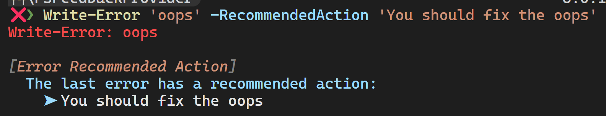

# PowerShell Script Based Feedback Providers

This module allows you to write feedback providers in PowerShell rather than C# and register them. A `[FeedbackContext]` is provided as an argument and you must return a single `[FeedbackItem]` object.

By default, feedback providers are registered for errors only. To register for another type, use the `-Trigger` parameter.

Also errors and potential issues are silently suppressed by default. Use the `-ShowDebugInfo` parameter of `Register-ScriptFeedbackProvider` to get useful information for troubleshooting feedback providers.

## Examples

### Echo the last command

```powershell
Register-ScriptFeedbackProvider -Name EchoCommand -Trigger All -ScriptBlock {
  param($context)
  [FeedbackItem]::new("Command was", $context.CommandLine)
}
```


### Report on a recommended action

```powershell
Register-ScriptFeedbackProvider -Name 'Error Recommended Action' {
  param($context)
  if ($context.LastError.ErrorDetails.RecommendedAction) {
    [FeedbackItem]::new(
      'The last error has a recommended action:',
      $context.LastError.ErrorDetails.RecommendedAction
    )
  }
}
```



## Authoring Intellisense

To get intellisense for $context, add the namespace at the top of your file.

```powershell
using namespace System.Management.Automation.Subsystem.Feedback
{
  param([FeedbackContext]$context)
  $context.<tab>
}
```

But do not include the namespace in your final command
